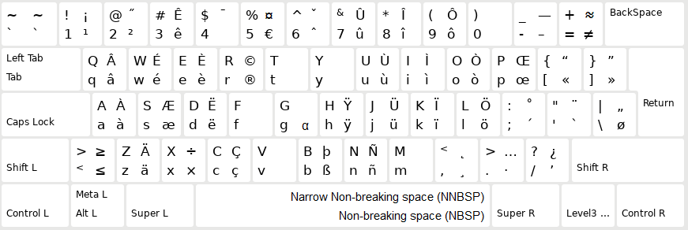

# ⌨ [QWERTY-fr](https://qwerty-fr.org/)

Keyboard layout based on the QWERTY layout with extra symbols and diacritics so that typing both in French and English is easy and fast. It is also easy to learn!

👉 You can [try this keyboard layout online](https://qwerty-fr.org) without installing it!

## 💭 Why?

The official and widely spread keyboard layout in France is [AZERTY](https://upload.wikimedia.org/wikipedia/commons/b/b9/KB_France.svg). Compared to QWERTY, it adds extra letters such as « é » and « ç ». Unfortunately a lot of characters are missing, for example it's impossible to type « É » or « Ç ». It's also impossible to type the French quotation marks (« »), and other special characters such as « œ » and « æ ». French users usually rely on autocorrect to fix the shortcomings of AZERTY, which is unacceptable.

Additionally, [AZERTY](https://upload.wikimedia.org/wikipedia/commons/b/b9/KB_France.svg) swaps letters around for no good reason compared to QWERTY (« A » and « Q » are swapped, « W » and « Z » are swapped as well. Most symbols are shuffled around, and for some reason « ² » has an entire key exlusively dedicated for it (?!). In turn, a lot of software has incompatible shortcuts and sometimes require to remap everything, which is extremely inconvenient.

In order to fix these issues, QWERTY-fr is a new keyboard layout that is entirely based on QWERTY and brings the best of both worlds — typing English is as fast as before, and extra characters are added so that one can effortlessly type in French (as well German, Spanish, Italian, etc.)

## 💡 Philosophy overview

This layout is a strict superset of the QWERTY layout. This means that **all the keys** of the QWERTY layout are kept in the same location. Anyone using a QWERTY layout can type on the QWERTY-fr layout without even knowing that they are not typing on a QWERTY layout.

In order to type special characters with diacritics, there are a few simple rules to know. <kbd>AltGr</kbd> corresponds to <kbd>Option ⌥</kbd> on macOS, and <kbd>Ctrl</kbd> <kbd>Alt</kbd> on Windows (useful if you don't have the <kbd>AltGr</kbd> key):

| Diacritic                              | How to type it                                                                                        |
|----------------------------------------|-------------------------------------------------------------------------------------------------------|
| Grave accent <code>`</code>            | Press <kbd>AltGr</kbd> + corresponding letter (works for letters e, u, i, o and a).                   |
| Acute accent <code>´</code>            | Press <kbd>AltGr</kbd> + key left the corresponding letter (works for the letter e).                  |
| Circumflex <code>^</code>              | Press <kbd>AltGr</kbd> + key above the corresponding letter (works for letters e, y, u, i, o and a).  |
| Diaeresis <code>¨</code>               | Press <kbd>AltGr</kbd> + key below the corresponding letter (works for letters e, y, u, i, o and a). |
| Cedilla <code>¸</code>                 | Press <kbd>AltGr</kbd> + corresponding letter (works for the letter c).                               |
| Ligature <code>œ</code>/<code>æ</code> | Press <kbd>AltGr</kbd> + key right the corresponding letter (works for letters o and a).              |

**Note**: Unlike AZERTY, you can combine all the accentuated letters with <kbd>Shift ⇧</kbd> and <kbd>Caps Lock</kbd>. So for example:
- <kbd>AltGr</kbd> <kbd>Shift ⇧</kbd> <kbd>C</kbd> outputs `Ç`.
- <kbd>AltGr</kbd> <kbd>Shift ⇧</kbd> <kbd>W</kbd> outputs `É`.

These two letters are impossible to type with an AZERTY layout. But with QWERTY-fr they are easy to type!

**Note 2**: You can type a [non-breaking space](https://en.wikipedia.org/wiki/Non-breaking_space) by pressing <kbd>AltGr</kbd> <kbd>Space</kbd>. And a [narrow non-breaking space (fr)](https://fr.wikipedia.org/wiki/Espace_fine_ins%C3%A9cable) by pressing <kbd>AltGr</kbd> <kbd>Shift ⇧</kbd> <kbd>Space</kbd>. Learn about when you should use them when typing French [here (fr)](https://typographisme.net/post/Les-espaces-typographiques-et-le-web).

## 📦 Installation

This keyboard layout is available Windows, Mac, and Linux.

### Windows

Download the [QWERTY-fr layout](https://github.com/qwerty-fr/qwerty-fr/releases/latest), extract it, and run **setup.exe**.

### Mac

Download the [QWERTY-fr layout](https://github.com/qwerty-fr/qwerty-fr/releases/latest) and extract **qwerty-fr.bundle** to :
- `/Library/Keyboard Layouts/` to install for all users.
- `~/Library/Keyboard Layouts/` for user-local installation.

You'll need to restart macOS before using it or otherwise you'll encounter bugs.

**Protip**: On Apple keyboards the right <kbd>Option ⌥</kbd> key is often hard to access. You can use [Karabiner-Elements](https://pqrs.org/osx/karabiner/) to switch the right <kbd>Option ⌥</kbd> key with the right <kbd>Commmand ⌘</kbd> key. This makes it easier to type characters!

### Linux

#### Ubuntu / Debian

Download the [Linux DEB file](https://github.com/qwerty-fr/qwerty-fr/releases/latest) and install it.

**Note**: On Ubuntu and other GNOME-based distributions, you need to [disable the Compose key functionality](https://askubuntu.com/a/1028964) or typing characters with <kbd>AltGr</kbd> won't work at all.

#### Archlinux

There is a user package for this: https://aur.archlinux.org/packages/xkb-qwerty-fr/
Use your favorite AUR helper to install it. Or in the directory containing the `PKGBUILD` file, run `makepkg -si`.

#### Other distros

You can download the [Linux ZIP file](https://github.com/qwerty-fr/qwerty-fr/releases/latest) and then extract it at the root of your filesystem.

# 🤝 Contributing

The easiest way to contribute to this project is to spread the word and the website [qwerty-fr.org](https://qwerty-fr.org).

If you want to contribute by fixing issues with the layout, adding new keys, etc. we use the following software to edit the layouts:
- **Windows**: [Microsoft Keyboard Layout Creator](https://www.microsoft.com/en-us/download/details.aspx?id=102134) ([mirror](https://web.archive.org/web/20200802184038/https://download.microsoft.com/download/1/1/8/118aedd2-152c-453f-bac9-5dd8fb310870/MSKLC.exe)).
- **Mac**: [Ukelele](https://software.sil.org/ukelele/).
- **Linux**: manually editing files.
